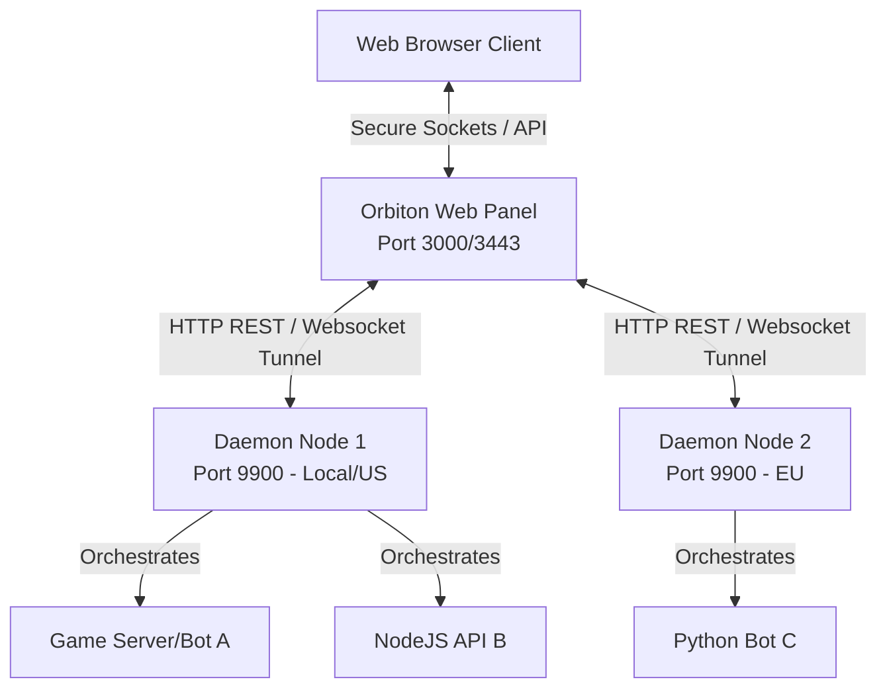

<div align="center">

# 🪐 Orbiton

**Next-Generation Multi-Node Application & Server Orchestrator**

*A lightweight, visual-first alternative to Pterodactyl. Deploy, monitor, and scale apps, bots, and game servers in real time.*

[](LICENSE)
[](https://nodejs.org)
[]()
[](https://github.com/iamprmgvyt/orbiton)
[](https://github.com/iamprmgvyt/orbiton/stargazers)

---

[📖 Read Documentation](https://docs-orbiton.vercel.app/) | [⚡ Quick Setup](#-installation--setup) | [🤝 Contributing Guide](#-contributing--development) | [💬 Submit Feedback](https://docs-orbiton.vercel.app/#feedback)

</div>

---

## 🚀 Why Orbiton?

Heavy panels like Pterodactyl require complex Docker daemon configurations, heavy databases, and high memory usage (usually >500MB just idling). **Orbiton** is designed from the ground up to be lightweight, lightning-fast, and visually stunning.

* **Featherweight footprint:** Idle memory is less than **50MB RAM** on SQLite.
* **All-in-One Runtime Shop:** Instantly compile, detect, or purge programming environments (Node.js, Python, Java, Docker, Go, Rust) directly from the browser.
* **Interactive Live Shell:** Stream raw process logs and send input commands instantly with true `node-pty` terminal sockets (zero latency).
* **Multi-Node architecture:** Scalable master-agent architecture to control hundreds of VPS hosts from one dashboard.

---

## ⚡ Multi-Node Architecture

Orbiton separates the visual panel interface (the Master) from the worker host machines (the Daemons/Wings) where the application code resides.



---

## ✨ Features Breakdown

* **🚀 App Orchestrator:** Full life-cycle controls (Start, Stop, Restart, Force Kill) for compile runtimes or Docker containers.
* **⌨️ Pterodactyl-style Console:** Fully functional TTY shell with terminal memory history buffer and live stream logging.
* **🛡️ Security Shield:** Automated random SQLite JWT generation and individual secure Master Tokens between nodes.
* **🔧 Port Firewall Manager:** Open, close, and monitor system ports directly from the Settings panel utilizing automated UFW rules.
* **📂 Embedded File Manager:** Full browser-based workspace file explorer (Create, Edit, Delete, Upload, Download, Zip/Unzip) for host folders.

---

## 🤖 Open Source Control Bots

Orbiton supports remote monitoring and power actions directly from Discord and Telegram via 2 plug-and-play bots located in the `bots/` folder:

*   **[Discord Bot](bots/discord-bot/)**: Contains both **Node.js (JavaScript)** and **Python** versions. Supports slash commands (`/status`, `/control`, `/stats`) to view applications and restart servers securely.
*   **[Telegram Bot](bots/telegram-bot/)**: Contains both **Python** and **Node.js (JavaScript)** versions. Supports commands (`/status`, `/control`, `/vps`) to check status and run daemon operations from Telegram chat.

To set up the bots, simply copy `.env.example` to `.env` in the respective bot directory and fill in your Orbiton Panel credentials. Detailed deployment instructions for both Node.js and Python are located in each bot's sub-folder.

---

## 📦 Installation & Setup

### Method 1: Auto-Installer (Recommended for Ubuntu VPS)

This interactive installer script automatically sets up Node.js, SQLite, UFW firewall configurations, generates systemd daemons, and configures startup services.

```bash
# Clone the repository
git clone https://github.com/iamprmgvyt/orbiton.git
cd orbiton

# Execute the interactive auto-installer
sudo bash install.sh
```

**Installer Options Menu:**
* **`[0]` All-in-One:** Installs both Web Panel and Daemon Node on the same machine.
* **`[1]` Web Panel:** Installs only the Master UI and database.
* **`[2]` Daemon Node:** Installs only the Wings daemon on target worker servers.
* **`[3]` Configure Let's Encrypt:** Set up HTTPS SSL configuration for your panel domain.
* **`[4]` Uninstall:** Purges Orbiton and all systemd daemons.
* **`[5]` Update Orbiton:** Pulls the latest version from GitHub, rebuilds dependencies, and restarts services.

### 🪐 Orbiton Global Command Line Interface (CLI)

Once installed, the global `orbiton` command is registered to your VPS. You can manage your panel and daemon node services using these short, easy commands:

```bash
# Start all Orbiton services
sudo orbiton start

# Stop all Orbiton services
sudo orbiton stop

# Restart Panel and Daemon (equivalent to complex service reload scripts)
sudo orbiton restart

# Monitor live systemd journal console logs
sudo orbiton logs

# Check service daemon health status
sudo orbiton status

# Trigger auto-update from GitHub
sudo orbiton update

# View CLI version and help menu
sudo orbiton version
sudo orbiton help
```

---

### Method 2: Manual Developer Setup

If you prefer to configure manually for development:

#### 1. Setup Daemon Node (Wings Agent)
```bash
cd daemon
npm install
cp .env.example .env # Add your target DATA_DIR and DAEMON_TOKEN
node server.js
```

#### 2. Setup Web Panel (Master Panel)
```bash
cd panel
npm install
cp .env.example .env # Add DAEMON_URL, DAEMON_TOKEN, and JWT_SECRET
node server.js
```

---

## 🔐 Credentials & Default Ports

| Component | Default Port | Default Credential |
|-----------|--------------|-------------------|
| **Web Panel** | `3000` (HTTP) / `3443` (HTTPS) | Set up your custom Admin account on first browser access! |
| **Daemon Node** | `9900` (HTTP) | Secure Master Token (defined in `.env`) |

---

## 📁 Repository Structure

```
orbiton/
├── panel/              # Express Web Panel & SQLite Database Wrapper
│   ├── server.js       # Web Panel entry server
│   ├── dist/           # Compiled production Frontend bundle
│   └── routes/         # Express admin API routes
├── daemon/             # Daemon Node Agent (Wings equivalent)
│   ├── server.js       # Daemon entry server
│   └── managers/       # Process spawning & node-pty streams
├── frontend/           # React Web Client codebase
│   └── src/            # Pages, Components, and Utilities
├── bots/               # Open Source Control Bots (Discord & Telegram)
│   ├── discord-bot/    # Discord bot controller (Node.js)
│   └── telegram-bot/   # Telegram bot controller (Python)
├── docs/               # Orbiton Documentation Web Site (Vite React)
├── install.sh          # Interactive bash installer script
└── README.md           # Gorgeous project index
```

---

## 🤝 Contributing & Development

Orbiton is a community-driven project and we welcome contributions of all forms!

* **Bug Reports & Ideas:** Submit an [Issue on GitHub](https://github.com/iamprmgvyt/orbiton/issues).
* **Pull Requests:** Fork the repo, make your edits, and open a PR. Please ensure code quality and follow modern ES6 coding guidelines.

Let's make server management beautiful and fast together!

---

## 💬 Feedback & Reviews
We love to hear from our users. Please share your suggestions and rate your experience on our interactive **[Feedback & Review Board](https://docs-orbiton.vercel.app/#feedback)**.

---

<div align="center">

*Orbiton — Manage everything, from anywhere.*

Made with ❤️ by [iamprmgvyt](https://github.com/iamprmgvyt)

</div>
